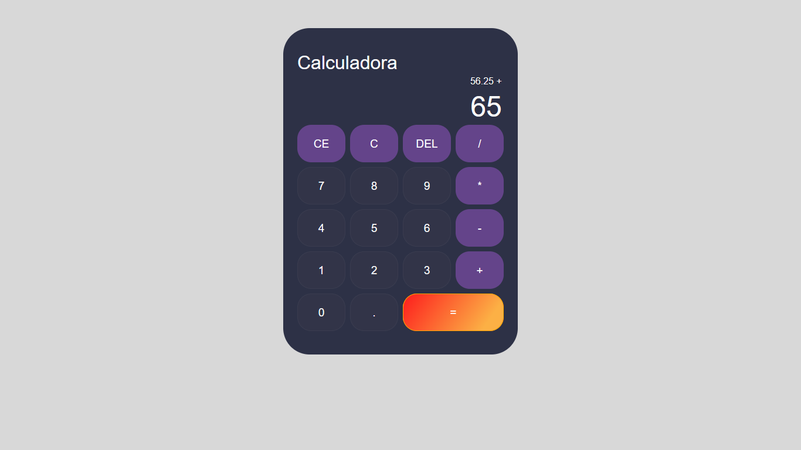
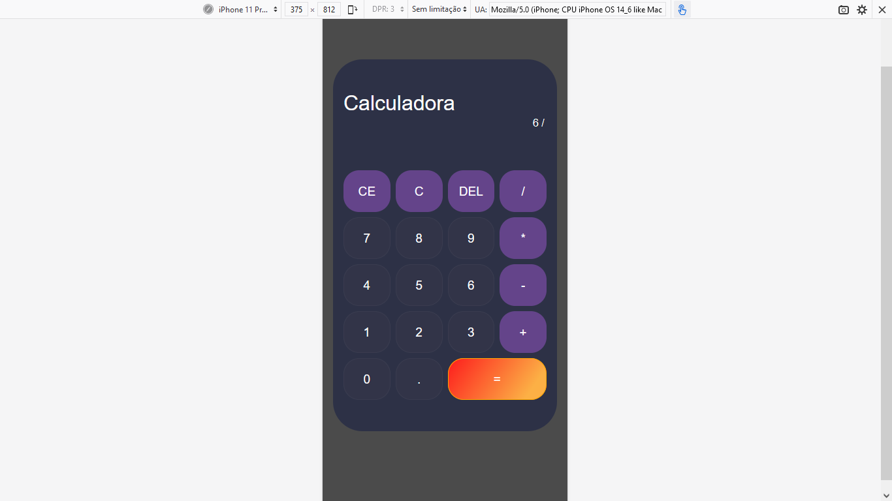

<h1>Calculadora javascript com Matheus Battisti</h1>
 

Exercício de manipulação de DOM com JavaScript, utilizando tutorial de Matheus Battisti.

 
<h2>Layout Desktop</h2>
 

 
<h2>Layout Desktop utilizando operações.</h2>
 

 
<h2>Layout Mobile</h2>
 

 
<h3>Sobre o desafio:</h3>
 

Eu demorei um certo tempo pra fazer este desafio pois a semana de trabalho foi bem corrido, e estou tendo dificuldades em acordar cedo e realizar os estudos de madrugada. Irei melhorar isso. Sobre o JavaScript, gostei do tutorial do Matheus Battist, porém é um vídeo bem batido, onde ele utilizou muitos comandos do Javascript que eu não conhecia, como por exemplo um milhão de <b>this</b>, mas foi interessante realizar o desafio. Irei assistir outros sobre calculadoras, mas preciso pegar vídeos mais explicativos que se adequem a mim neste momento.
